# Laporan Praktikum 1

<h4>Nama : Yudhistira Putra Hartanto<h4>
<h4>Nim : 254107020083<h4>
<h4>Kelas : TI-1G<h4>

## 1.10 LATIHAN

### 1.10.1 Latihan Konseptual

#### Latihan 1.1

Jelaskan 5 fungsi utama sistem operasi dengan contoh konkret dari minimal 2
OS berbeda (Windows, macOS, atau Linux).

>Jawaban :  
Sistem operasi modern memiliki lima fungsi utama:
>1. Process Management  
<b>Sistem operasi bertanggung jawab untuk :</b>  
• Process scheduling — Menentukan proses mana yang mendapat CPU time  
• Process creation dan termination — Membuat dan mengakhiri proses  
• Process synchronization — Mengkoordinasikan multiple processes  
• Inter-process communication (IPC) — Memfasilitasi komunikasi antar proses    
<b>Contoh implementasi :</b>  
• Windows: Task Manager menampilkan proses yang berjalan dan penggunaan sumber daya  
• Linux: Perintah ps, top, dan htop untuk memantau proses  
• macOS: Activity Monitor untuk mengelola proses
>
>2. Memory Management   
<b>Fungsi memory management meliputi :</b>  
• Memory allocation — Memberikan memori ke proses yang membutuhkan  
• Virtual memory — Menggunakan disk sebagai extension dari RAM  
• Memory protection — Mencegah satu proses mengakses memori proses lain  
• Paging dan swapping — Teknik untuk optimasi penggunaan memori  
<b>Contoh implementasi :</b>  
Virtual Memory, ketika RAM penuh, sistem operasi memindahkan sebagian data ke disk (swap
space di Linux, pagefile di Windows) sehingga aplikasi dapat terus berjalan,
meskipun dengan kinerja yang lebih lambat.
>
>3. File Management   
<b>Sistem operasi menyediakan :</b>  
• Organisasi file system — Struktur hirarkis (direktori, subdirektori)  
• Operasi file — Membuat, membaca, menulis, menghapus file  
• Kontrol akses — Izin (permissions) untuk keamanan  
• Mounting file system — Mengintegrasikan perangkat penyimpanan ke sistem  
<b>Contoh implementasi :</b>  
• Windows: NTFS (New Technology File System)  
• macOS: APFS (Apple File System)  
• Linux: ext4, XFS, Btrfs  
>
>4. I/O Management  
<b>Manajemen Input/Output mencakup :</b>  
• Device drivers — Perangkat lunak untuk berkomunikasi dengan perangkat keras  
• Buffering — Penyimpanan sementara untuk kelancaran operasi I/O  
• Interrupt handling — Merespon sinyal dari perangkat keras  
• Spooling — Antrean untuk perangkat seperti printer   
<b>Contoh Implementasi :</b>  
• Windows: Saat kita memasukkan flashdisk USB, Windows secara otomatis mendeteksi perangkat tersebut dan menggunakan driver yang sesuai (misalnya usbstor.sys) untuk berkomunikasi dengan perangkat keras. Proses ini terjadi di latar belakang tanpa perlu campur tangan pengguna.  
• Linux: Di Linux, ketika perangkat baru seperti printer atau scanner terhubung melalui USB, kernel menggunakan driver seperti usbcore dan usb-storage untuk mengakses perangkat. Pengguna juga bisa melihat daftar driver yang digunakan melalui perintah lsmod atau melihat perangkat di /dev.
>
>5. Security dan Protection  
<b>Aspek keamanan meliputi :</b>  
• Authentication — Verifikasi identitas pengguna (password, biometrik)  
• Authorization — Kontrol akses ke sumber daya berdasarkan izin (permissions)  
• Encryption — Proteksi data (BitLocker di Windows, FileVault di macOS)  
• Auditing — Pencatatan aktivitas sistem untuk pemantauan keamanan  
<b>Contoh Implementasi : </b>   
• Windows: Windows memiliki fitur BitLocker yang digunakan untuk mengenkripsi seluruh drive. Misalnya, jika laptop dicuri, data di dalamnya tetap aman karena tidak bisa diakses tanpa kunci pemulihan atau password.  
• Linux: Di Linux, pengguna bisa menggunakan LUKS (Linux Unified Key Setup) untuk enkripsi disk. Saat instalasi Ubuntu, pengguna bisa memilih opsi Encrypt the entire disk untuk melindungi data.

#### Latihan 1.2

Kapan sebaiknya menggunakan Windows vs Linux vs macOS?  
Analisis berdasarkan use case: gaming, development, server, creative work, dan enterprise.

>Jawaban :  
>1. Untuk gaming,   
Windows masih menjadi pilihan yang tidak terbantahkan karena mendukung DirectX 12, kompatibilitas dengan hampir semua game AAA, serta dukungan driver GPU terbaik dari NVIDIA dan AMD, sementara Linux hanya bisa dipertimbangkan untuk game-game ringan dengan catatan harus siap bereksperimen dengan Proton, dan macOS sama sekali tidak direkomendasikan karena katalog game sangat terbatas serta Apple Silicon tidak mendukung dual-boot Windows.
>
>2. Untuk pengembangan perangkat lunak,   
pilihan OS sangat bergantung pada jenis development yang dilakukan. Linux unggul untuk pengembangan backend, infrastruktur cloud, dan pekerjaan yang berkaitan dengan kontainer seperti Docker, karena lingkungannya mirip dengan production server dan manajemen paketnya efisien. macOS menjadi keharusan jika Anda mengembangkan aplikasi iOS atau bekerja di ekosistem Apple, selain itu sistem berbasis UNIX dengan pengalaman pengguna premium ini juga sangat cocok untuk web development dan frontend. Windows tetap menjadi pilihan utama untuk pengembangan aplikasi .NET dan teknologi Microsoft, ditambah dengan kehadiran WSL yang memungkinkan pengembangan Linux berjalan mulus di atas Windows.
>
>3. Dalam ranah server,   
Linux mendominasi dengan pangsa pasar sekitar 80% karena alasan biaya yang gratis, stabilitas tinggi yang mampu berjalan bertahun-tahun tanpa reboot, keamanan yang baik, serta kemudahan manajemen jarak jauh melalui SSH. Windows Server hanya relevan untuk organisasi yang sudah terikat dengan ekosistem Microsoft seperti Active Directory, Exchange, atau aplikasi berbasis .NET, namun konsekuensinya harus siap dengan biaya lisensi yang mahal dan kebutuhan hardware lebih besar. macOS Server praktis sudah tidak relevan karena Apple menghentikan produk ini sejak 2022.
>
>4. Untuk pekerjaan kreatif,  
Seperti desain grafis, video editing, dan produksi musik, macOS menjadi pilihan utama profesional karena keunggulan akurasi warna, aplikasi eksklusif seperti Final Cut Pro dan Logic Pro, serta performa Apple Silicon yang luar biasa untuk rendering. Windows tetap menjadi alternatif kuat terutama untuk 3D rendering dan animasi yang membutuhkan GPU high-end, serta untuk aplikasi seperti 3ds Max yang eksklusif di platform ini. Linux sangat terbatas untuk kebutuhan kreatif karena tidak mendukung Adobe Creative Cloud dan tools profesional lainnya, meskipun memiliki alternatif open source seperti GIMP dan Blender.
>
>5. Di lingkungan enterprise atau perusahaan,   
Windows menjadi pilihan paling aman untuk organisasi besar dengan ribuan karyawan non-teknis karena kemudahan manajemen terpusat melalui Active Directory dan Group Policy, serta kompatibilitas dengan aplikasi bisnis legacy. macOS cocok untuk perusahaan kreatif atau startup teknologi dimana karyawan lebih produktif dengan ekosistem Apple, serta dapat dikelola melalui solusi MDM seperti Jamf. Linux dipilih untuk workstation teknis, tim data science, dan tentu saja untuk seluruh kebutuhan server, namun jarang digunakan sebagai desktop pengguna umum karena kurva pembelajaran yang curam dan keterbatasan aplikasi perkantoran.

### 1.10.2 Latihan Praktikal

#### Latihan 1.3

Install Ubuntu Server 22.04 LTS di VirtualBox dengan langkah berikut:
1. Download Ubuntu Server ISO dari website resmi
2. Create VM baru di VirtualBox (RAM: 2GB, Disk: 25GB)
3. Install dengan automatic partitioning (guided)
4. Buat user account dengan password yang kuat
5. Reboot dan login ke sistem
6. Dokumentasikan proses instalasi dengan screenshot key step

>Jawaban :  
>1. Step 1  
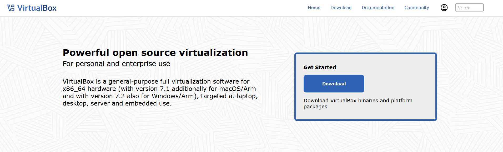
>2. Step 2  
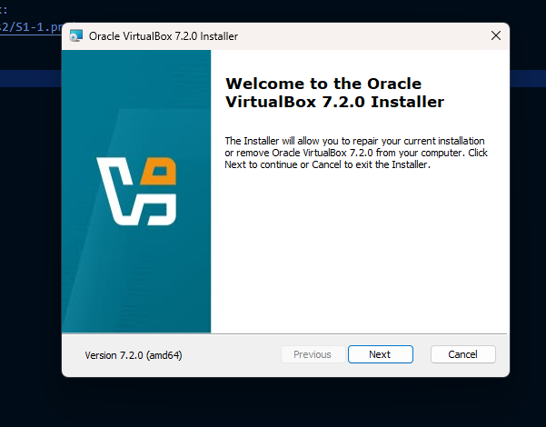
>3. Step 3  

>4. Step 4  
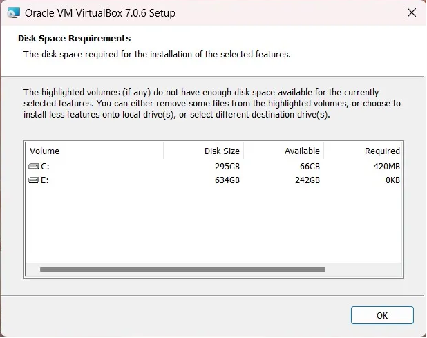
>5. Step 5  

>6. Step 6  

>7. Step 7  

>8. Step 8   

>9. Step 9   
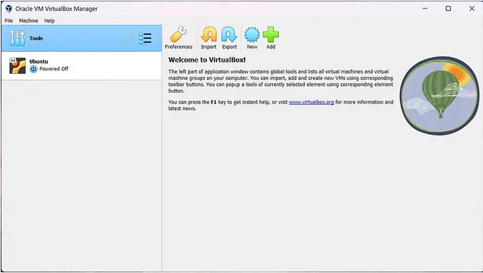
>10. Step 10   
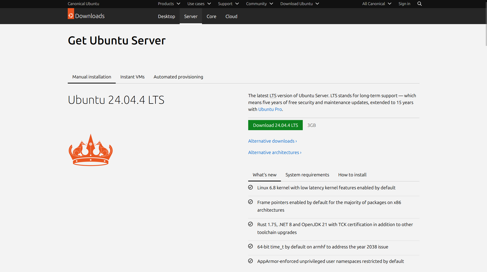
>11. Step 11   
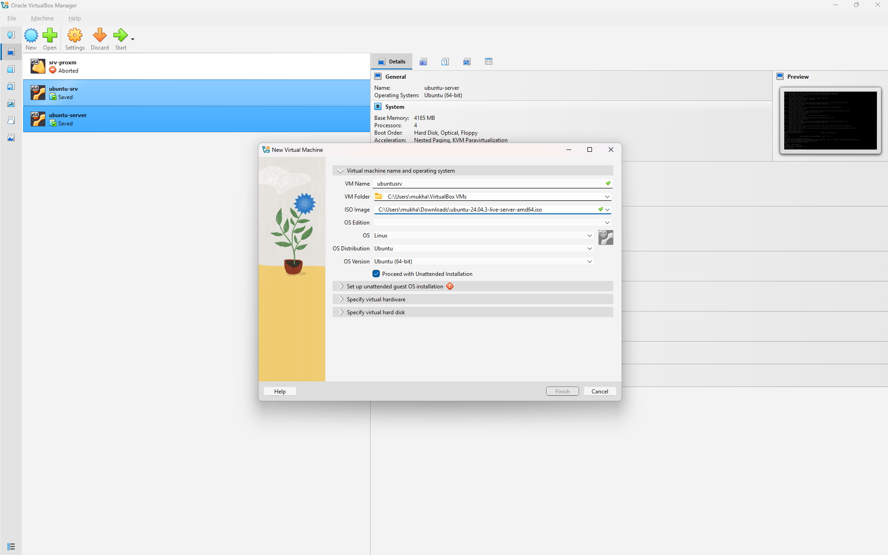
>12. Step 12   
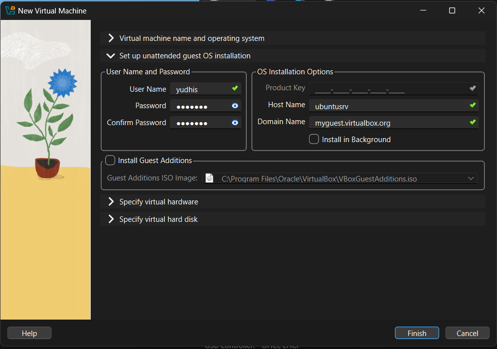
>13. Step 13  
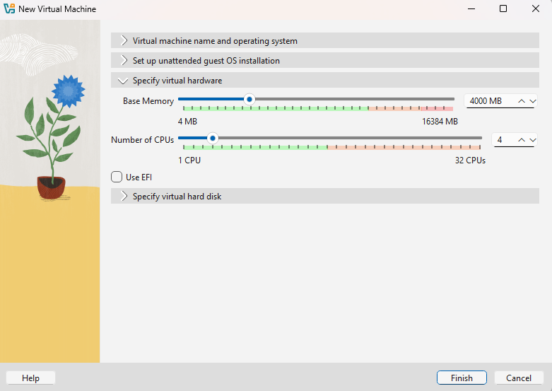
>14. Step 14  

>15. Step 15  
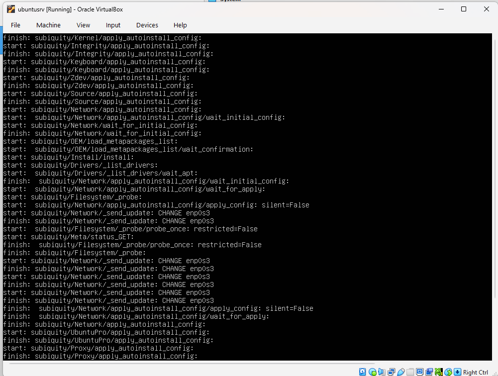
>16. Step 16  

>17. Step 17  
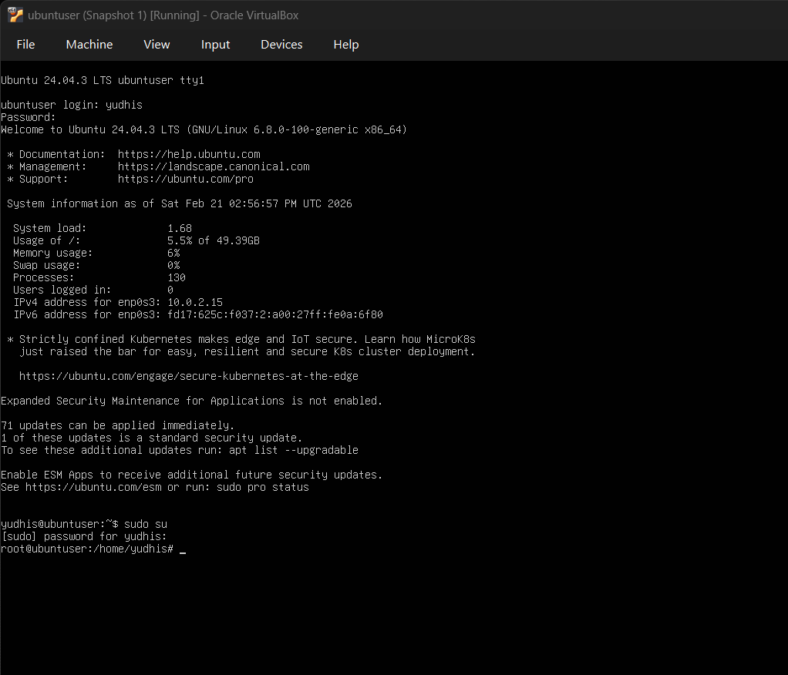

#### Latihan 1.4

Setelah instalasi Ubuntu Server, lakukan tasks berikut:
1. Update package list: sudo apt update
2. Upgrade packages: sudo apt upgrade
3. Install neofetch: sudo apt install neofetch
4. Jalankan neofetch dan screenshot hasilnya
5. Check disk usage dengan df -h
6. Check memory dengan free -h
7. Dokumentasikan output dari setiap command

>Jawaban :  
>1. Step 1  
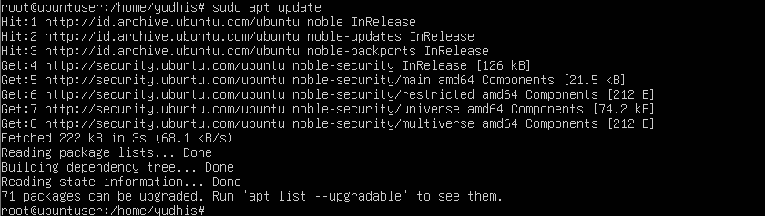
>2. Step 2  
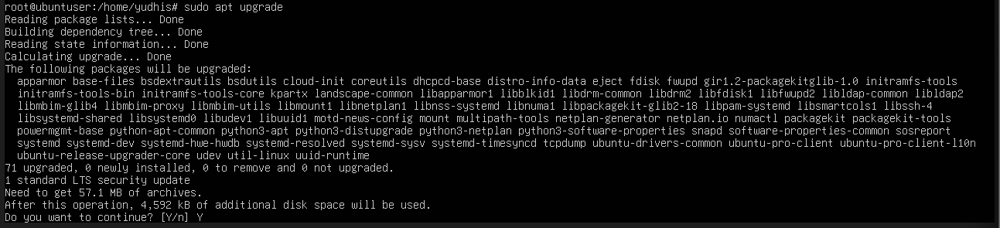
>3. Step 3  
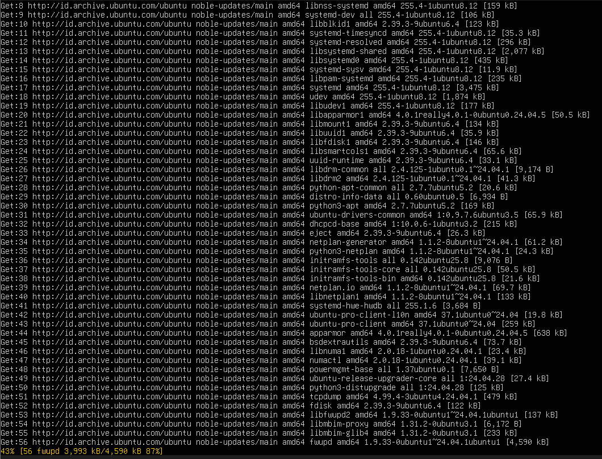
>4. Step 4  
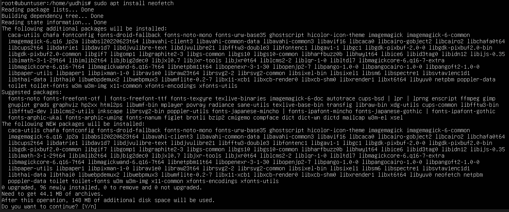
>5. Step 5  
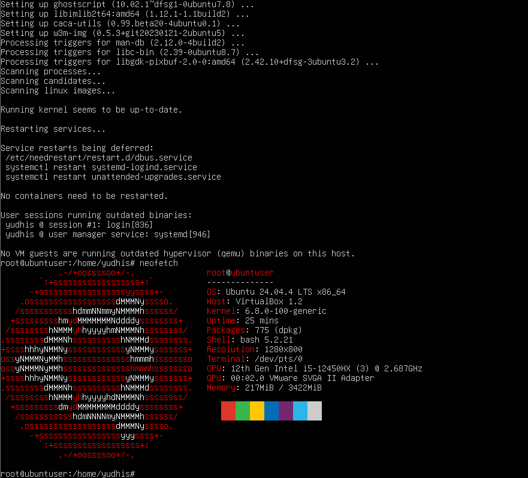
>6. Step 6   
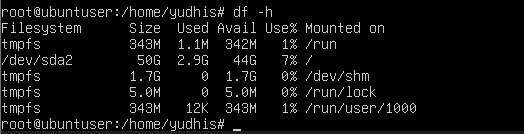
>7. Step 7  
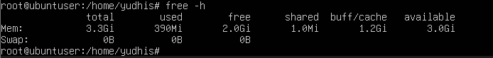

#### Latihan 1.5

Eksplorasi sistem yang baru diinstall:
1. Tampilkan informasi OS: cat /etc/os-release
2. Tampilkan versi kernel: uname -r
3. List partisi: lsblk
4. Check network connectivity: ping -c 4 google.com
5. Install dan jalankan htop untuk melihat resource usage
6. Buat laporan singkat tentang konfigurasi sistem Anda

>Jawaban :   
>
><b>LAPORAN KONFIGURASI SISTEM UBUNTU SERVER</b>
>
>Hostname: ubuntuser
>
><b>A. SPESIFIKASI SISTEM</b>  
>Sistem Operasi: Ubuntu 22.04.3 LTS (Jammy Jellyfish)
>
>Kernel Linux: 5.15.0-91-generic
>
>Arsitektur: 64-bit (x86_64)
>
>Uptime: 15:37:03 up 40 min, 1 user, load average: 0.00, 0.02, 0.04
>
><b>B. KONFIGURASI HARDWARE</b>  
>Processor: 12th Gen Intel(R) Core(TM) i5-12450HX, jumlah core : 3
>
>RAM Total: 3.14 GB
>
>Penggunaan RAM saat ini: 11818.2%
>
>Disk Total: 50.5G
>
>Penggunaan Disk: 7% dari partisi root (/)
>
>Partisi: Konfigurasi LVM dengan partisi terpisah untuk /boot
>
><b>C. KONEKTIVITAS JARINGAN</b>  
>Interface jaringan: enp0s3
>
>Alamat IP: 10.0.2.15
>
><b>D. LAYANAN DAN PROSES</b>  
>Jumlah proses berjalan: 125 proses
>
>Proses dengan penggunaan CPU tertinggi: kworker/1:1-events
>
>Proses dengan penggunaan memori tertinggi: sbin/multipathd -d -s
>
>Package manager: APT dengan repository Ubuntu 22.04
>
><b>E. APLIKASI TERINSTAL</b>  
>Neofetch: Untuk menampilkan informasi sistem
>
>htop: Monitor proses interaktif
>
>Lainnya: Paket dasar Ubuntu Server
>
><b>F. KESIMPULAN</b>  
>Sistem Ubuntu Server berhasil diinstal dan berjalan dengan baik. Semua komponen hardware terdeteksi dengan benar, koneksi jaringan berfungsi optimal, dan resource sistem masih sangat mencukupi untuk kebutuhan server dasar. Sistem siap digunakan untuk berbagai peran seperti web server, database server, atau pengembangan aplikasi.

### 1.10.3 Latihan Latihan Refleksi

#### Latihan 1.6

Ceritakan pengalaman Anda dengan sistem operasi:
1. Sistem operasi apa yang Anda gunakan sehari-hari? (Windows, macOS,
Linux, atau lainnya)
2. Berapa lama Anda menggunakan sistem operasi tersebut?
3. Apa yang Anda sukai dari sistem operasi tersebut?
4. Apa tantangan atau masalah yang pernah Anda hadapi?
5. Apakah Anda pernah menggunakan sistem operasi lain? Bandingkan
pengalaman Anda.
6. Setelah mempelajari bab ini, apakah ada sistem operasi lain yang ingin
Anda coba? Mengapa?
Tulis refleksi Anda dalam 300-500 kata disertai dengan dokumentasi.

>Jawaban :
>1. Sistem operasi yang saya gunakan sehari-hari adalah Windows.
>
>2. Saya telah menggunakan Windows selama 14 tahun, dimulai dari versi Windows 7 hingga sekarang Windows 10/11. Saya dikenalkan komputer pertama kali pada ketika saya masih kecil, dulu saat masih kecil hanya digunakan untuk bermain game
>
>3. Yang paling saya sukai dari Windows adalah kemudahan penggunaannya, terutama untuk pemula atau pengguna umum. Antarmuka yang intuitif membuat siapa saja bisa langsung mengoperasikannya tanpa perlu belajar khusus. Selain itu, hampir semua aplikasi yang saya butuhkan tersedia di platform ini, mulai dari aplikasi perkantoran, desain, hingga game.
>
>4. Tantangan terbesar dengan Windows adalah masalah performa seiring waktu. Semakin lama digunakan, Windows cenderung melambat karena banyaknya aplikasi yang terinstal, file sementara yang menumpuk, dan registri yang semakin membesar. Seringkali saya harus melakukan maintenance seperti disk cleanup, defragmentasi, atau bahkan instal ulang sistem untuk mengembalikan performa seperti semula. Update Windows yang kadang datang di waktu tidak tepat juga menjadi tantangan tersendiri.
>
>5. Baru-baru ini saya mulai menggunakan Ubuntu sebagai media belajar untuk perkuliahan. Pengalaman menggunakan Ubuntu tentu berbeda dengan Windows. Saya masih harus banyak menyesuaikan diri karena lingkungannya yang berbasis command line dan cara kerja yang berbeda. Beberapa aplikasi yang biasa saya gunakan di Windows tidak tersedia secara native di Ubuntu, sehingga harus mencari alternatif atau menggunakan wine. Namun, saya mulai menyukai kebebasan dan kontrol yang ditawarkan Ubuntu, terutama untuk keperluan server dan pengembangan.
>
>6. Setelah mempelajari bab ini, saya ingin mencoba memahami lebih dalam penggunaan Ubuntu. Ketertarikan ini muncul karena saya sadar bahwa Linux (termasuk Ubuntu) menjadi fondasi dari banyak teknologi modern seperti server, cloud computing, dan container. Dari latihan praktik yang dilakukan, saya baru merasakan sedikit dari kemampuan Ubuntu dan ingin menggali lebih dalam tentang administrasi sistem, networking, dan berbagai layanan yang bisa dijalankan di atasnya. Saya yakin dengan menguasai Ubuntu, saya akan memiliki nilai tambah di dunia IT yang semakin berkembang.  
<b>Dokumentasi</b>

